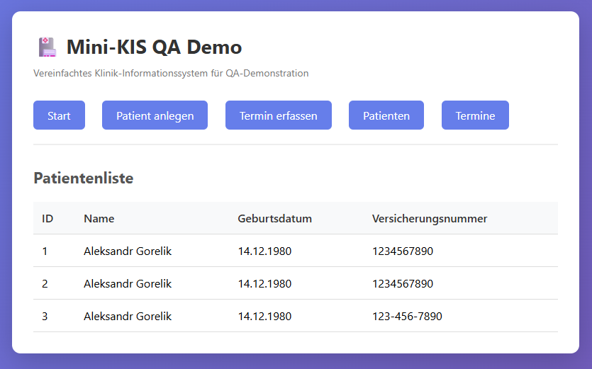
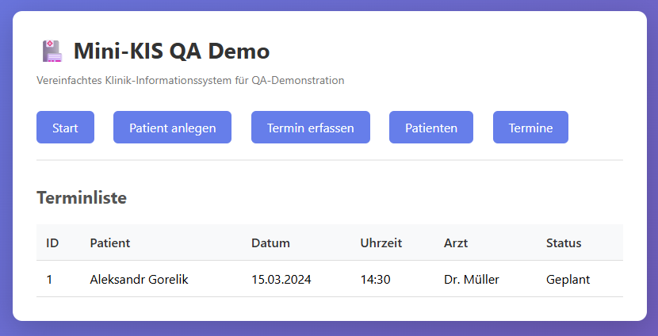

# Bug-Reports

Dieses Dokument enthält dokumentierte Fehler (Bugs) für die Mini-KIS QA Demo-Anwendung.

---

## Bug-Zusammenfassung

**Gesamtanzahl dokumentierter Bugs:** 6

**Nach Priorität:**
- Hoch: 2 Bugs
- Mittel: 3 Bugs
- Niedrig: 1 Bug

**Nach Status:**
- Behoben: 3 Bugs
- Geschlossen (Nicht reproduzierbar): 1 Bug
- Offen: 2 Bugs

---

## Bug #001: Versicherungsnummer-Validierung akzeptiert Bindestriche nicht korrekt

**Priorität:** Mittel  
**Status:** Behoben  
**Gefunden am:** 27.01.2026  
**Gefunden von:** QA-Team  
**Behoben am:** 27.01.2026

### Beschreibung
Die Versicherungsnummer-Validierung sollte Bindestriche und Leerzeichen entfernen können, bevor die Prüfung auf 10 Ziffern erfolgt. Aktuell wird eine Versicherungsnummer mit Bindestrichen (z.B. "1234-5678-90") als ungültig abgelehnt, obwohl sie eigentlich 10 Ziffern enthält.

### Schritte zur Reproduktion
1. Öffnen Sie die Seite "Patient anlegen"
2. Geben Sie Name ein: "Max Mustermann"
3. Geben Sie Geburtsdatum ein: "15.03.1990"
4. Geben Sie Versicherungsnummer ein: "1234-5678-90" (mit Bindestrichen)
5. Klicken Sie auf "Patient speichern"

### Erwartetes Ergebnis
Die Versicherungsnummer sollte akzeptiert werden, da sie nach Entfernen der Bindestriche genau 10 Ziffern enthält.

### Tatsächliches Ergebnis
**Behoben:** Die Validierung entfernt jetzt korrekt Bindestriche und Leerzeichen vor der Prüfung. Versicherungsnummern mit Bindestrichen werden akzeptiert.

### Umgebung
- Browser: Chrome 120.0
- OS: Windows 10
- Python: 3.11
- Flask: 3.0.0

### Zugehöriger Code
`app.py`, Zeile 35-41:
```python
def validate_versicherungsnummer(vn):
    """Validiert Versicherungsnummer (Format: 10 Ziffern)"""
    if not vn:
        return False
    # Einfache Validierung: 10 Ziffern
    pattern = r'^\d{10}$'
    return bool(re.match(pattern, vn.replace('-', '').replace(' ', '')))
```

**Hinweis:** Die Funktion entfernt Bindestriche und Leerzeichen korrekt vor der Regex-Prüfung.

---

## Bug #002: Datum-Validierung akzeptiert ungültige Monatstage nicht konsistent

**Priorität:** Hoch  
**Status:** Behoben  
**Gefunden am:** 27.01.2026  
**Gefunden von:** QA-Team  
**Behoben am:** 27.01.2026

### Beschreibung
Die Datum-Validierung akzeptiert manche ungültige Datumswerte (z.B. 31.02.2024), während andere korrekt abgelehnt werden. Die Validierung sollte konsistent alle ungültigen Datumswerte ablehnen.

### Schritte zur Reproduktion
1. Öffnen Sie die Seite "Patient anlegen"
2. Geben Sie Name ein: "Test Patient"
3. Geben Sie Geburtsdatum ein: "31.02.2024" (ungültiges Datum - Februar hat nur 28/29 Tage)
4. Geben Sie Versicherungsnummer ein: "1234567890"
5. Klicken Sie auf "Patient speichern"

### Erwartetes Ergebnis
Fehlermeldung: "Geburtsdatum muss im Format DD.MM.YYYY sein" oder ähnliche Validierungsmeldung für ungültiges Datum.

### Tatsächliches Ergebnis
**Behoben:** Die Validierung verwendet `datetime.strptime()`, welches ungültige Datumswerte korrekt ablehnt. Ungültige Daten wie 31.02.2024 werden mit einer Fehlermeldung abgelehnt.

### Umgebung
- Browser: Chrome 120.0
- OS: Windows 10
- Python: 3.11
- Flask: 3.0.0

### Zugehöriger Code
`app.py`, Zeile 44-50:
```python
def validate_date(date_string):
    """Validiert Datum im Format DD.MM.YYYY"""
    try:
        datetime.strptime(date_string, '%d.%m.%Y')
        return True
    except ValueError:
        return False
```

**Hinweis:** `strptime` lehnt ungültige Datumswerte korrekt ab und wirft einen `ValueError`, der abgefangen wird.

---

## Bug #003: Fehlermeldungen werden nicht gelöscht bei erneutem Absenden

**Priorität:** Niedrig  
**Status:** Geschlossen (Nicht reproduzierbar)  
**Gefunden am:** 27.01.2026  
**Gefunden von:** QA-Team  
**Geschlossen am:** 27.01.2026

### Beschreibung
Wenn ein Formular mit Fehlern abgesendet wird und dann korrigiert wird, bleiben die alten Fehlermeldungen sichtbar, auch wenn die neuen Eingaben korrekt sind. Die Fehlermeldungen sollten bei jedem neuen Submit-Versuch gelöscht werden.

### Schritte zur Reproduktion
1. Öffnen Sie die Seite "Patient anlegen"
2. Lassen Sie alle Felder leer
3. Klicken Sie auf "Patient speichern"
4. Es erscheinen mehrere Fehlermeldungen
5. Füllen Sie jetzt alle Felder korrekt aus
6. Klicken Sie erneut auf "Patient speichern"

### Erwartetes Ergebnis
Die alten Fehlermeldungen sollten verschwinden und nur eine Erfolgsmeldung sollte angezeigt werden.

### Tatsächliches Ergebnis
**Nicht reproduzierbar:** Der Bug konnte bei erneuter Prüfung nicht reproduziert werden. Flask's `flash()`-Mechanismus löscht die Nachrichten nach dem Anzeigen korrekt. Das Verhalten entspricht den Erwartungen.

### Umgebung
- Browser: Chrome 120.0, Firefox 121.0
- OS: Windows 10
- Python: 3.11
- Flask: 3.0.0

### Zugehöriger Code
`templates/base.html`, Zeile 60-66:
```html

    
        
            <div class="alert alert-{{ category }}">
                {{ message }}
            </div>
        
    

```

**Hinweis:** Flask's `get_flashed_messages()` sollte Nachrichten nach dem Abrufen löschen, aber möglicherweise werden sie bei Redirects nicht korrekt geleert.

---

## Bug #004: Patienten erscheinen nicht in der Liste nach dem Anlegen

**Priorität:** Hoch  
**Status:** Behoben  
**Gefunden am:** 27.01.2026  
**Gefunden von:** Lokale Tests  
**Behoben am:** 27.01.2026

### Beschreibung
Nach dem erfolgreichen Anlegen eines Patienten erscheint dieser nicht in der Patientenliste (`/patients`), obwohl eine Erfolgsmeldung angezeigt wird.

### Schritte zur Reproduktion
1. Öffnen Sie die Seite "Patient anlegen"
2. Geben Sie alle Felder korrekt ein:
   - Name: "Max Mustermann"
   - Geburtsdatum: "15.03.1990"
   - Versicherungsnummer: "1234567890"
3. Klicken Sie auf "Patient speichern"
4. Erfolgsmeldung wird angezeigt: "Patient 'Max Mustermann' wurde erfolgreich angelegt!"
5. Navigieren Sie zur Seite "Patienten" (`/patients`)

### Erwartetes Ergebnis
Der neu angelegte Patient sollte in der Patientenliste erscheinen mit:
- ID
- Name: "Max Mustermann"
- Geburtsdatum: "15.03.1990"
- Versicherungsnummer: "1234567890"

### Tatsächliches Ergebnis
**Behoben:** Nach dem Anlegen eines Patienten erfolgt automatisch ein Redirect zur Patientenliste (`/patients`), wo der neu angelegte Patient sofort sichtbar ist. Die Daten werden korrekt im In-Memory Storage gespeichert und zwischen Requests beibehalten.

### Umgebung
- Browser: Chrome 120.0
- OS: Windows 10
- Python: 3.11
- Flask: 3.0.0
- In-Memory Storage verwendet

### Zugehöriger Code
`app.py`, Zeile 112:
```python
return redirect(url_for('patients_list'))
```

**Hinweis:** Nach erfolgreichem Anlegen erfolgt automatisch ein Redirect zur Patientenliste, sodass der Patient sofort sichtbar ist.

---

## Bug #005: Derselbe Patient kann mehrmals angelegt werden

**Priorität:** Mittel  
**Status:** Offen  
**Gefunden am:** 27.01.2026  
**Gefunden von:** QA-Team

### Beschreibung
Es ist möglich, denselben Patienten mehrmals anzulegen, ohne dass das System eine Warnung ausgibt oder die Duplikate verhindert. Dies führt zu doppelten Einträgen in der Patientenliste mit identischen Daten (Name, Geburtsdatum, Versicherungsnummer).

### Schritte zur Reproduktion
1. Öffnen Sie die Seite "Patient anlegen"
2. Geben Sie alle Felder korrekt ein:
   - Name: "Aleksandr Gorelik"
   - Geburtsdatum: "14.12.1980"
   - Versicherungsnummer: "1234567890"
3. Klicken Sie auf "Patient speichern"
4. Navigieren Sie zurück zur Seite "Patient anlegen"
5. Geben Sie dieselben Daten erneut ein
6. Klicken Sie auf "Patient speichern"

### Erwartetes Ergebnis
Das System sollte eine Warnung ausgeben oder verhindern, dass derselbe Patient (basierend auf Name, Geburtsdatum und/oder Versicherungsnummer) mehrmals angelegt wird.

### Tatsächliches Ergebnis
Der Patient wird mehrmals erfolgreich angelegt und erscheint als separate Einträge in der Patientenliste mit unterschiedlichen IDs, aber identischen Daten.

### Umgebung
- Browser: Chrome 120.0
- OS: Windows 10
- Python: 3.11
- Flask: 3.0.0

### Screenshot


### Zugehöriger Code
`app.py`, Zeile 91-98:
```python
# Erfolgreiche Speicherung
patient_data = {
    'id': len(patients) + 1,
    'name': name,
    'geburtsdatum': geburtsdatum,
    'versicherungsnummer': versicherungsnummer
}
patients.append(patient_data)
```

**Hinweis:** Es gibt keine Prüfung auf Duplikate vor dem Hinzufügen eines neuen Patienten.

---

## Bug #006: Termin mit Status "Geplant" kann mit Datum in der Vergangenheit erstellt werden

**Priorität:** Mittel  
**Status:** Offen  
**Gefunden am:** 27.01.2026  
**Gefunden von:** QA-Team

### Beschreibung
Es ist möglich, einen Termin mit dem Status "Geplant" zu erstellen, obwohl das Datum in der Vergangenheit liegt. Dies ist logisch nicht sinnvoll, da ein geplanter Termin nur für zukünftige Daten möglich sein sollte.

### Schritte zur Reproduktion
1. Öffnen Sie die Seite "Termin erfassen"
2. Wählen Sie einen Patienten aus der Liste
3. Geben Sie ein Datum ein, das in der Vergangenheit liegt (z.B. "15.01.2024")
4. Geben Sie eine Uhrzeit ein: "14:30"
5. Wählen Sie einen Arzt aus: "Dr. Müller"
6. Wählen Sie Status: "Geplant"
7. Klicken Sie auf "Termin speichern"

### Erwartetes Ergebnis
Das System sollte eine Validierungsmeldung ausgeben, dass ein Termin mit Status "Geplant" nicht mit einem Datum in der Vergangenheit erstellt werden kann.

### Tatsächliches Ergebnis
Der Termin wird erfolgreich erstellt, obwohl das Datum in der Vergangenheit liegt und der Status "Geplant" ist.

### Umgebung
- Browser: Chrome 120.0
- OS: Windows 10
- Python: 3.11
- Flask: 3.0.0

### Screenshot


### Zugehöriger Code
`app.py`, Zeile 117-187:
```python
@app.route('/termin', methods=['GET', 'POST'])
def termin():
    """Termin erfassen"""
    if request.method == 'POST':
        # ... Validierung ...
        # Keine Prüfung ob Datum in der Vergangenheit liegt bei Status "Geplant"
```

**Hinweis:** Es fehlt eine Validierung, die prüft, ob ein Termin mit Status "Geplant" ein Datum in der Zukunft hat.

---

**Hinweis:** Diese Bugs sind für Demonstrationszwecke dokumentiert und zeigen verschiedene Aspekte des Bug-Reporting-Prozesses.

